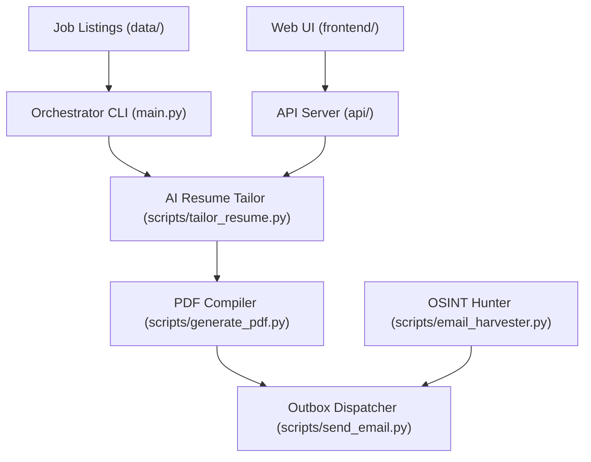

# 💼 Job Scout & Autonomous Recruiter Outbound Engine

<p align="center">
  
  
  
  
</p>

An autonomous, local, high-leverage recruitment and outbound pipeline designed to manage, evaluate, and execute targeted career outreach to tech companies.

---

## 🎯 System Architecture



---

## 🚀 Key Features

*   **⚡ Autonomous Job Sourcing**: Automatically scrapes and discovers new listings using Apify and RSS feeds.
*   **🎯 AI-Powered Resume Tailoring**: Leverages Gemini models to align resume experience and keywords with job descriptions dynamically.
*   **📄 ReportLab PDF Compiler**: Creates single-page, ATS-optimized resumes locally without external document-generation services.
*   **🔍 Recruiter OSINT Finder**: Automates Google dorking queries and integrates snov.io APIs to pinpoint hiring manager emails.
*   **✉️ SMTP Outreach Dispatch**: Connects directly to secure email servers with rate-limiting protection to send cover emails with tailored PDF attachments.
*   **📊 Interactive Web Dashboard**: Includes a fully responsive local web dashboard to review scraped opportunities, score relevance, and execute outreach.

---

## 📂 Directory Architecture

```
job-scout-engine/
├── api/                       # Backend API server and routes
│   ├── routes/                # Route definitions
│   ├── server.py              # Server entry point
│   └── db.py                  # Database connection utility
├── frontend/                  # Web-based frontend UI
│   ├── index.html             # Job search dashboard
│   ├── app.js                 # Dashboard logic
│   └── style.css              # Dashboard styling
├── scripts/                   # Core pipeline operations
│   ├── tailor_resume.py       # Tailors resume JSON using Gemini
│   ├── generate_pdf.py        # Compiles resume JSON into PDF
│   ├── email_harvester.py     # Email extraction and validation
│   ├── auto_pilot.py          # Command-line autonomous scout pipeline
│   └── send_email.py          # Email drafter and secure SMTP sender
├── requirements.txt           # Python package dependencies
├── .env.example               # Template environment configuration
├── .gitignore                 # Safe repository ignore list
├── README.md                  # Operational documentation
└── main.py                    # Orchestrator CLI entry point
```

---

## ⚡ Setup & Installation

### 1. Install Dependencies
Ensure you have Python 3.10+ installed. Install the required Python packages:
```bash
python -m pip install -r requirements.txt
```

### 2. Configure Environment Variables
Copy `.env.example` to `.env` and fill in your keys:
```bash
cp .env.example .env
```
Update the values in `.env` with your API credentials and sender details.

---

## 🎯 How to Run the Pipeline

### Option A: The Orchestrator CLI
Run the central interactive menu:
```bash
python main.py
```

### Option B: The Web Dashboard
Start the local server:
```bash
python api/server.py
```
Then, open `frontend/index.html` in your browser to view the interactive dashboard.

---

## 🛠️ Customization & Extensibility

- **Master Resume**: Update your master resume details in your base resume JSON. Any new certifications, achievements, or skills will immediately be used as the new source of truth.
- **Outreach Logs**: Sent email drafts and history are logged locally to help monitor outbound volume and track follow-ups.

---

## 💡 Operational Best Practices

- **Daily Volume**: To preserve your email domain reputation, keep cold outreach volume below **15-20 highly personalized emails per day**.
- **Pacing**: Use the built-in delay functions in the automation scripts to pace your sends and avoid triggering spam filters.
